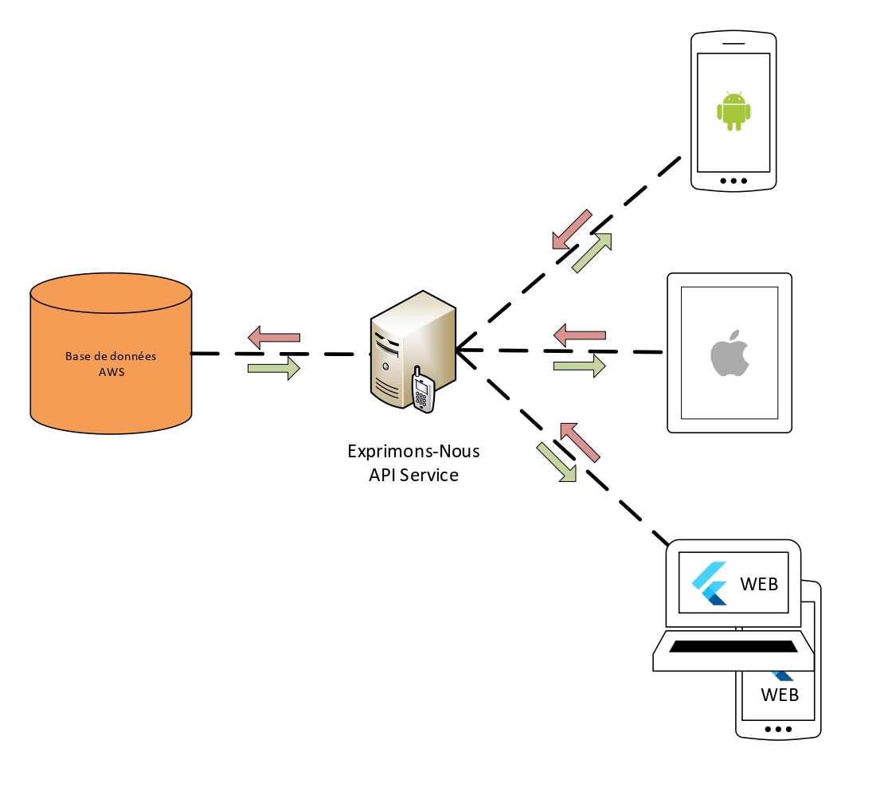
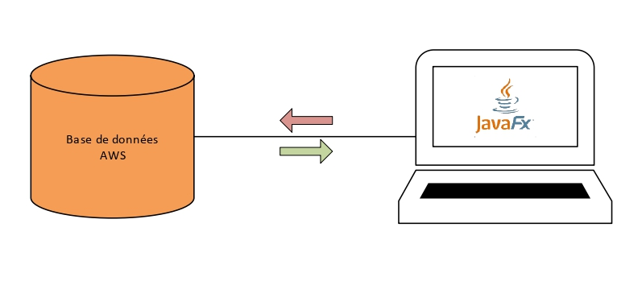

# Les bases de données
## Détails des configurations des différentes bases de données mises en place pour le fonctionnement de la plateforme Exprimons-Nous.
###### Monté par Théo TORRES DA COSTA, Sarah KOUTA-LOPATEY et Kilian CASSAIGNE

## Base de données - Exprimons Nous
Cette base de données distante a été mise en place pour le fonctionnement des applications Android, Flutter et iOS de la plateforme. Cette base de données est exploitée par une API donc se servent les applications pour la lecture et l'écriture de données sur cette base de données.

### Fournisseur
AWS
### Moteur de l'instance
MySQL v8.0.27

## Base de données - Exprimons Projet
Cette base de données distante a été mise en place pour le fonctionnement de l'application desktop Java. Cette base de données n'est exploitée que par cette application.

### Fournisseur
AWS
### Moteur de l'instance
MySQL v8.0.27

## Auteur(s)
### Conception
* Sarah KOUTA-LOPATEY
* Théo TORRES DA COSTA
* Kilian CASSAIGNE

### Mise en place et maintien
* Sarah KOUTA-LOPATEY

### Base de données Exprimons-Projet
### Conception
* Sarah KOUTA-LOPATEY

### Mise en place et maintien
* Sarah KOUTA-LOPATEY
